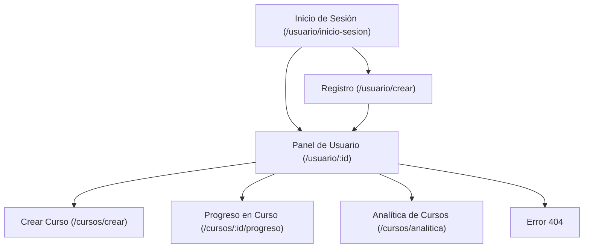
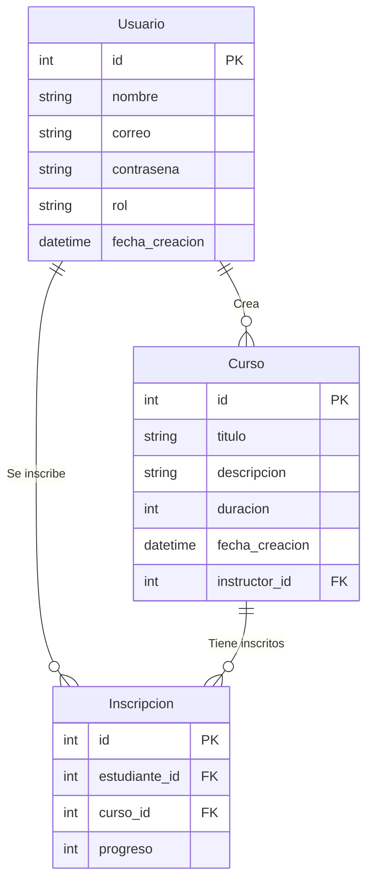

# **TechWorld Learning Platform**

Una plataforma web diseñada para gestionar cursos de manera eficiente, proporcionando herramientas tanto para estudiantes como para instructores.

## **Descripción**

TechWorld Learning Platform permite a los usuarios registrarse, inscribirse en cursos, ver su progreso y analizar datos en tiempo real. El proyecto está diseñado siguiendo una arquitectura **MVC (Modelo-Vista-Controlador)**, utilizando tecnologías modernas para garantizar escalabilidad y facilidad de uso.

### **Características principales:**

- Registro e inicio de sesión con autenticación segura (JWT).
- Roles diferenciados para estudiantes e instructores.
- Gestión de cursos: creación, inscripción y seguimiento del progreso.
- Panel de analítica para obtener estadísticas básicas de los cursos.
- Diseño responsivo con Bootstrap y vistas dinámicas con Handlebars.

## **Visuales**

**Mapa del Sitio:**



**Modelo de Datos:**



## **Empezando 🚀**

Sigue estas instrucciones para obtener una copia funcional del proyecto en tu máquina local.

### **Prerrequisitos 📋**

- **Sistema Operativo:** Ubuntu 20.04 / Windows 10 / macOS.
- **Node.js:** Versión 16 o superior.
- **NPM:** Versión 7 o superior.
- **Base de Datos:** MySQL.

### **Instalación 🔧**

1. **Clonar el repositorio:**

   ```bash
   git clone https://github.com/tu-repositorio/techworld.git
   cd techworld
   ```

2. **Instalar dependencias:**

   ```bash
   npm install
   ```

3. **Configurar la base de datos:**
   Crea un archivo `.env` en la raíz del proyecto con el siguiente contenido:

   ```env
   DB_HOST=localhost
   DB_USER=root
   DB_PASSWORD=tu_password
   DB_NAME=techworld
   JWT_SECRET=supersecretkey
   ```

4. **Crear la base de datos:**
   Si usas conexión manual, ejecuta el script SQL incluido en `database/setup.sql`. Si usas Sequelize, corre las migraciones:

   ```bash
   npx sequelize-cli db:migrate
   ```

5. **Iniciar el servidor:**

   ```bash
   npm start
   ```

6. **Abrir la aplicación:**
   Accede a `http://localhost:3000`.

## **Construido Con 🛠️**

- **Backend:**
  - Node.js
  - Express.js
  - JSON Web Token (JWT)
  - bcrypt para encriptar contraseñas
- **Frontend:**
  - Handlebars
  - Bootstrap
- **Base de Datos:**
  - MySQL
  - Sequelize (opcional, configurado por defecto)

## **Estructura del Proyecto 📂**

```plaintext
/techworld
├── /controllers
│   ├── authController.js         # Controlador de autenticación
│   ├── courseController.js       # Controlador de cursos
│   └── userController.js         # Controlador de usuarios
├── /models
│   ├── user.js                   # Modelo de Usuario
│   ├── course.js                 # Modelo de Curso
│   └── inscription.js            # Modelo de Inscripción
├── /routes
│   ├── authRoutes.js             # Rutas para autenticación
│   ├── courseRoutes.js           # Rutas para cursos
│   └── userRoutes.js             # Rutas para usuarios
├── /views
│   ├── /layouts
│   │   └── main.handlebars       # Layout base
│   ├── /partials
│   │   └── navbar.handlebars     # Barra de navegación
│   ├── login.handlebars          # Vista de inicio de sesión
│   ├── register.handlebars       # Vista de registro
│   ├── dashboard.handlebars      # Vista del panel de usuario
│   ├── create-course.handlebars  # Vista para crear cursos
│   ├── progress.handlebars       # Vista del progreso en cursos
│   ├── analytics.handlebars      # Vista analítica
│   └── error.handlebars          # Página de error
├── /public
│   ├── /css
│   │   └── styles.css            # Estilos personalizados
│   └── /js
│       └── main.js               # Lógica frontend
├── app.js                        # Configuración del servidor
└── package.json                  # Dependencias
```

## **Versionado 📌**

Usamos [Git](https://git-scm.com) para el versionado. Ve las [etiquetas](https://github.com/your/project/tags) disponibles.

## **Autores ✒️**

- **[Brayan Diaz C]** - _Desarrollador principal_ - [GitHub](https://github.com/brayandiazc)
